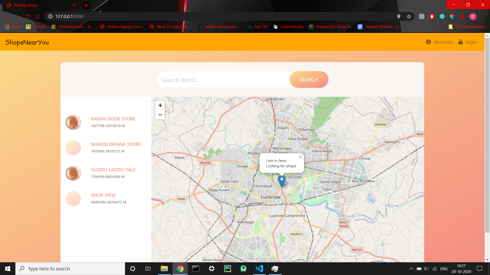
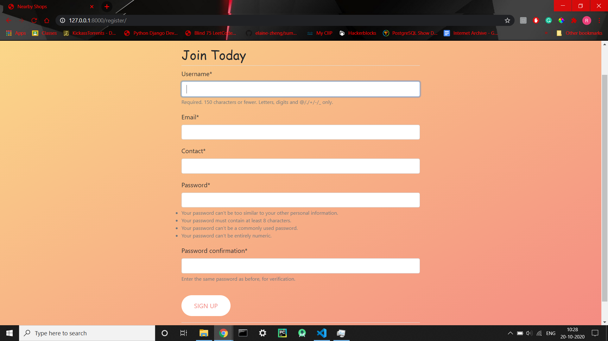
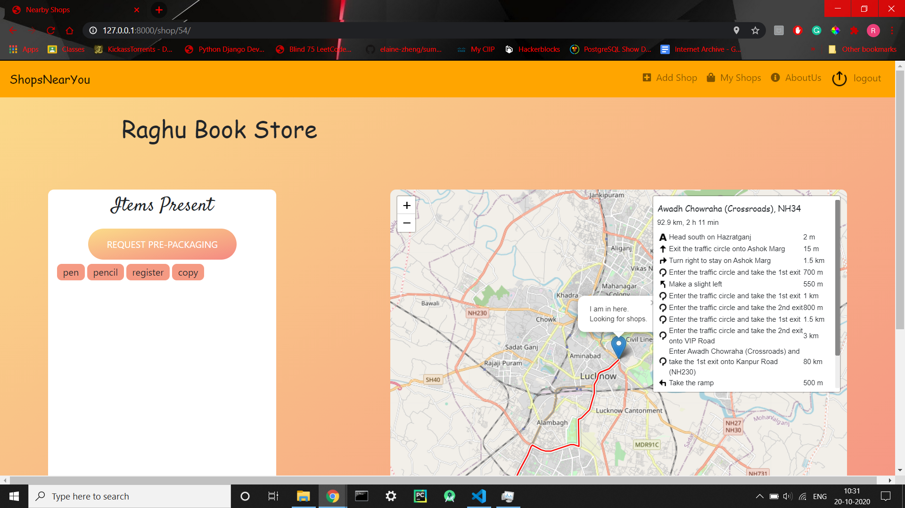
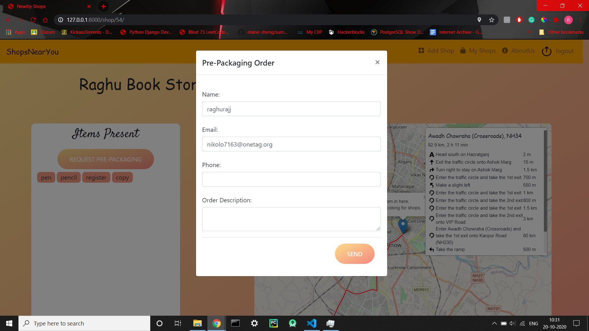
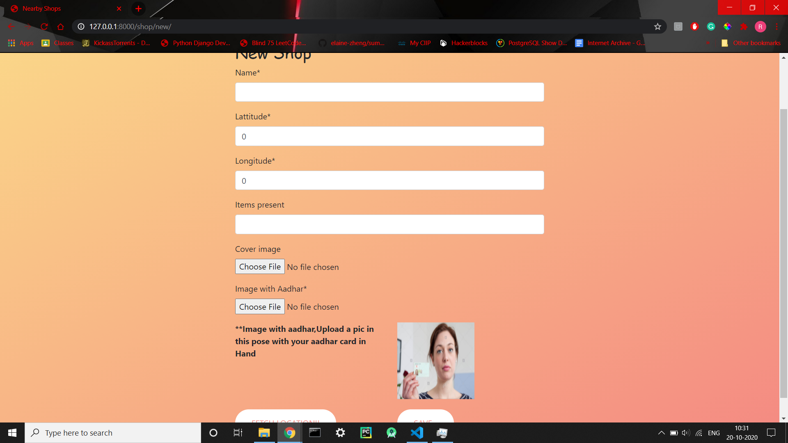
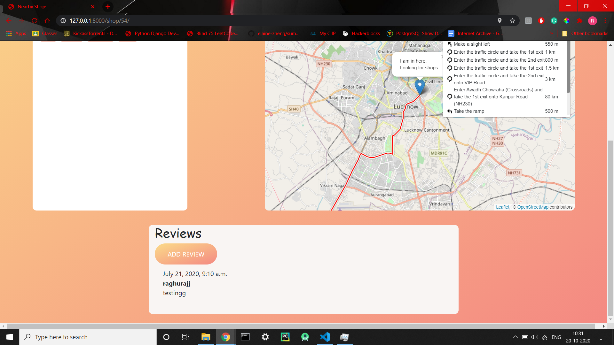

# ShopsNearYou

---
ShopsNearYou is a platfrom where shop owners can add their shops and customers can find the shops according to the Items they need.

# Features
    -Shop owner can Add/Update/Delete their Shops
    -Customers can search shops by name of items they want
    -Shops will be shown on Maps and in a list with ascending order of distance.
    -Customers can give reviews to the shops
    -customers can request prepackaging
    -login/signup
    -website is completely responsive

### Screenshots
-User Registration Page

---
-Shop Detail Page

---
-Pre-Packaging Page

---
-Add Shop Page

---
-Add review Page

---

### Tech Stack
    -Django

### Database 
    -postgresql

